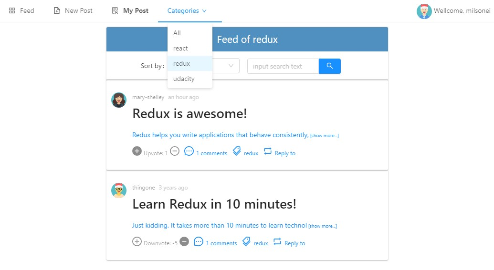
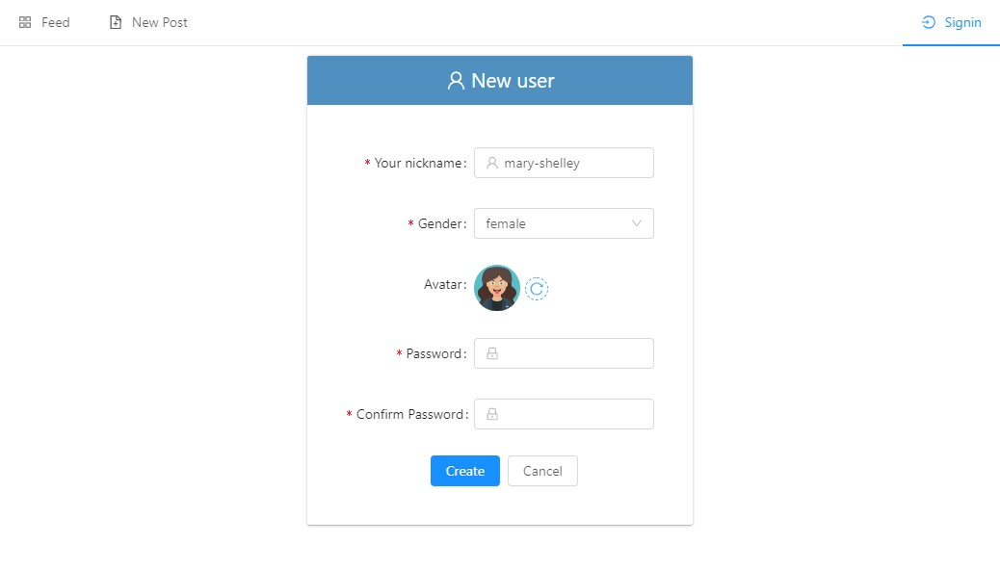

# Readable
## Project Purpose

This app was built for the Udacity React Nanodegree Program. The purpose of the project is to demonstrate understanding of the basic structure and operation of a Redux-based app.

## How to Load the App
### Hosted version

You can run a responsive hosted version of the app at [milsonei-readable.surge.sh/](https://milsonei-readable.surge.sh/)

### Instalation
Once Node is installed, navigate to the directory where you want to store the app

```
git clone https://github.com/milsonei/reactnd-readable.git
npm install
```

### Project
The project uses Node.js and the Create-React-App starter. If you do not have **Node >= 8.x** installed, you can download it here: [Node.js](https://nodejs.org/en/)

```bash
├── README.md - This file.
├── package.json #npm package manager file. It's unlikely that you'll need to modify this.
├── public
│   ├── favicon.ico #React Icon, You may change if you wish.
│   └── index.html #DO NOT MODIFY
├── src
│    ├── actions
│    │   ├── authedUser.js #Action creator for Authed with sigin and signout actions.#
│    │   ├── avatar.js #Action creator for Avatar with receive new avatar action.#
│    │   ├── categories.js #Action creator for Categories with receive new categories action.#│
│    │   ├── comments.js #Action creator for Comments with receive, add and delete categories action.#	
│    │   ├── error.js #Action creator to show an error notification about the previous action having completed with error.#
│    │   ├── loaded.js #Action creator for indicate that app was loaded.#
│    │   ├── posts.js #Action creator for Posts with CRUD, incremend and decrement comment counter actions.#
│    │   ├── redirect.js #Indicates that a route redirection will occur.#
│    │   ├── remember.js # ction creator that indicates the username to be remembered at next login.#
│    │   ├── search.js #Action creator that cleans the text previously searched, as well as the cleaning of this text upon completion.#
│    │   ├── shared.js #Action creator to load the initial data# 	
│    │   ├── success.js #Action creator that indicates success of the previous action.# 
│    │   └── users.js #Creator of actions for Users with actions of creation of new user, change of password and change of avatar.# 	
│    ├── api
│    │   ├── api.js #Async function to get initial data from remote and local data storage.#
│    │   ├── BaseApi.js #Api base class that sends web requests to the remote data server using axios, a promise based HTTP client for the browser and node.js#
│    │   ├── CategoryApi.js #Class responsible for sending requests to the remote data server relative to the Category entity. This class is a BaseApi class specialization.#
│    │   ├── CommentApi.js #Class responsible for sending requests to the remote data server relative to the Comment entity. This class is a BaseApi class specialization.#
│    │   ├── PostApi.js #Class responsible for sending requests to the remote data server relative to the Post entity. This class is a BaseApi class specialization.#
│    │   ├── UserApi.js #Class responsible for sending requests to the remote data server relative to the User entity. This class is a BaseApi class specialization.#
│    │   └──  myaxios.js #New instance of axios with a custom config. Axios is a promise based HTTP client for the browser and node.js.#
│    ├── components
│    │   ├── App.js #This is the root of app. Contains static HTML right now.#
│    │   ├── CategoryMeny.js #Stateless component responsible for create a category menu based on Dropdown component from React UI library ANTD.#
│    │   ├── CommentEditor.js #Component responsible for create a textarea for inputting comments, a "Add Comment "button and "Clear' button based on Form, TextArea e Button components from React UI library ANTD.#
│    │   ├── CommentList.js #Component responsible for create a comment list based on custom component MyComment.#
│    │   ├── FeedPage.js #Component responsible for rendering a page that lists all posts based on the MyPost custom component, which shows the title, body limited to 60 characters, author, time, comment counter, and post category.#
│    │   ├── LoginPage.js #Component responsible for rendering a page that allows a registered user to enter the app using a nickname and password, as well as a link to open the new user registration page.#
│    │   ├── MyComment.js #Component responsible for displaying all details of a comment, such as author, creation time, and buttons to increment or decrement the comment score. If the logged in user is the author, he or she can delete the comment.#
│    │   ├── MyPost.js #Component responsible for displaying all details of a post, such as author, creation time, comments counter, category, and buttons to increment or decrement the posting score. If the logged in user is the author, they can delete or edit the post in view mode. The following React UI library ANTD components are used: Alert, Comment, Icon, Tooltip, Avatar, Row, Col and Popconfirm.#
│    │   ├── Nav.js #Component responsible for generating the top menu of the application. Because it is a component that is rendered on all pages, it serves as the point of redirection. This component renders the Menu, Icon and Avatar components from React UI library ANTD.#	
│    │   ├── PostEditPage.js #Component responsible for rendering a page for creating and editing a particular post. The AND components used on this page are: Avatar, Tooltip, Select, Form, Button, Input.#
│    │   ├── PostViewPage.js #Component responsible for creating the preview page for all details of a particular post and the comments associated with this post. The AND components used on this page are: Form, Avatar, Comment, and Col.#
│    │   ├── SearchInput.js #Component responsible for creating a search field based on the Search component from React UI library ANTD#
│    │   ├── SortSelector.js #Component responsible for creating a list containing fields available for sorting a list of posts or comments. The AND components used on this page are: Form, Select and Tooltip.#
│    │   ├── UserEditPage.js #Component responsible for rendering a page for creating and editing a particular user. The AND components used on this page are: Icon, Form, Button, Input, Avatar, Tooltip, Select, Row, Col.#
│    ├── middleware
│    │   ├── cache.js #Middleware responsible for being a common point of capture and storage in the local data storage coming from several actions.#
│    │   ├── error.js #Component responsible for being a common point to capture and view the error message using the notification component from React UI library ANTD.#
│    │   ├── index.js #Initialize store and dispatch, which will be used later.#
│    │   └── logger.js #Middleware responsible for logging action details and status details in the browser console. Available only in the development environment.#	
│    ├── model
│    │   ├── Comment.js #Class associated with a data entity Comment#
│    │   ├── Post.js #Class associated with a data entity Post#
│    │   └── User.js #Class associated with a data entity User#
│    ├── reducer - Specify how the application''s state changes in response to actions sent to the store
│    │   ├── authedUser.js
│    │   ├── avatar.js
│    │   ├── categories.js
│    │   ├── comments.js
│    │   ├── index.js #combine reducers#
│    │   ├── loaded.js 
│    │   ├── posts.js 
│    │   ├── redirect.js
│    │   ├── remember.js
│    │   ├── search.js
│    │   ├── sort.js
│    │   ├── success.js 
│    │   └── users.js
│    ├── css #Styles for app#
│    │   ├── App.css
│    ├── utils #utilities for app
│    │   ├── Utilities.js #This class provides support functions for the entire application#│
│    │   ├── SecurityUtil.js #Utility that provides functions for encrypting and decrypting using the CryptoJS API#
│    │   └── DialoUtil.js #This class provides functions that show notifications and dialogs from the ANTD library#
│    ├── App.test.js #Used for testing. Provided with Create React App.
│    ├── index.css #Global styles. You probably won't need to change anything here.
└───└── index.js #You should not need to modify this file. It is used for DOM rendering only.
```

### Main dependencies
```bash
 └── node_modules
      ├── axios (version >= 0.18.0) #Promise based HTTP client for the browser and node.js. See more in https://github.com/axios/axios#installing
      ├── crypto-js (version >= 3.1.9-1) #JavaScript library of crypto standards. See more in https://github.com/brix/crypto-js#nodejs-install
      ├── DateDiff (version >= 0.2.1) #DateDiff is a minimalized javascript date arithmetic extension.. See more in https://github.com/melvinsembrano/date-diff#installation
      ├── moment (version >= 0.2.1) #Parse, validate, manipulate, and display dates and times in JavaScript. See more in http://momentjs.com
      ├── antd (version >= 3.10.9) #Ant Design of React - React UI library antd that contains a set of high quality components and demos for building rich, interactive user interfaces. See more in https://ant.design/docs/react/introduce#Installation
      ├── lib
      │   ├── avatar #Avatars can be used to represent people or objects. It supports images, Icons, or letters. See more in https://ant.design/components/avatar/
      │   ├── Button #To trigger an operation. See more in https://ant.design/components/button/
      │   ├── tooltip #A simple text popup tip. See more in https://ant.design/components/tooltip/
      │   ├── alert #Alert component for feedback. See more in https://ant.design/components/alert/
      │   ├── Popconfirm #A simple and compact confirmation dialog of an action. See more in https://ant.design/components/Popconfirm/
      │   ├── Form #Form is used to collect, validate, and submit the user input, usually contains various form items including checkbox, radio, input, select, and etc. See more in https://ant.design/components/form/
      │   ├── Input #A basic widget for getting the user input is a text field. Keyboard and mouse can be used for providing or changing data. See more in https://ant.design/components/input/
      │   ├── Select #Select component to select value from options. See more in https://ant.design/components/select/
      │   ├── Dropdown #A dropdown list. See more in https://ant.design/components/dropdown/
      │   ├── grid #Grids System. See more in https://ant.design/components/grid/
      │   │   ├──Col
      │   │   └── Row 
      │   ├── notification # Display a notification message globally. see more in https://ant.design/components/notification/
      │   ├── Menu # Menu list of Navigation. see more in https://ant.design/components/menu/
      │   ├── icon #Semantic vector graphics. see more in https://ant.design/components/icon/
      │   └── modal #Modal dialogs. see more in https://ant.design/components/modal/
      ├── sort-by (version >= 1.2.0) #utility to create comparator functions for the native Array.sort() in both node and the browser.
      │                               #Allows for sorting by multiple properties. see more in https://www.npmjs.com/package/sort-by
      └── prop-types (version >= 15.6.2) #Runtime type checking for React props and similar objects. see more in https://www.npmjs.com/package/prop-types
```

Once all of the dependencies have been installed you can launch the app with

```
npm start
```
A new browser window should automatically open displaying the app. If it doesn't, navigate to [http://localhost:3000/](http://localhost:3000/) in your browser


## How to Use the App
- After loading the app, the post feed appears first.
- In the categories menu, you can choose the desired category for filtering.
 
- Controls for sorting and searching are available on the top toolbar.
- To view the details of a post you need to click on it.
 
- To add a comment or a new post, the user must be logged in to the application.
 
- If you have not yet registered for the application, the process is fast. You should only choose a unique nickname, your gender and an avatar that will be randomly generated according to the chosen genre. if you do not like the generated avatar, you can click the button on the right side to generate a new one.
 
- After registering, the application will be redirected to the login page, where you can enter the newly registered credentials.
- You can now create your first post!
 
- After clicking on your newly created post to see the details, the options for editing and deleting it will be available.
 
- When you click the delete button, a message will be displayed to confirm the deletion of the post.
 
- When you click the edit button, the application will be redirected to the edit page where you can change any details of the post.
 
- To add a comment, click the post you want to show details. Now just write your comment and add. Good luck!
 
- After you add a comment, it will be added to the comment list below the post, where you can delete it, if desired.
 
- You can vote for a post or comment by just clicking the + to up vote and - to down vote buttons . Feel free!
- In the user menu, options are available to view and edit the profile, change the password, and exit the application.
- In the profile you can choose a new avatar.
 
- You can also change your password.
 
## Backend Server

To simplify your development process, we've provided a backend server for you to develop against. The provided file [`BooksAPI.js`](src/BooksAPI.js) contains the methods you will need to perform necessary operations on the backend:

* [`getAll`](#getall)
* [`update`](#update)
* [`search`](#search)

### `getAll`

Method Signature:

```js
getAll()
```

* Returns a Promise which resolves to a JSON object containing a collection of book objects.
* This collection represents the books currently in the bookshelves in your app.

### `update`

Method Signature:

```js
update(book, shelf)
```

* book: `<Object>` containing at minimum an `id` attribute
* shelf: `<String>` contains one of ["wantToRead", "currentlyReading", "read"]  
* Returns a Promise which resolves to a JSON object containing the response data of the POST request

### `search`

Method Signature:

```js
search(query)
```

* query: `<String>`
* Returns a Promise which resolves to a JSON object containing a collection of a maximum of 20 book objects.
* These books do not know which shelf they are on. They are raw results only. You'll need to make sure that books have the correct state while on the search page.

## Resources and Documentation:

- [Create-react-app Documentation](https://github.com/facebookincubator/create-react-app)
- [React Router Documentation](http://knowbody.github.io/react-router-docs/)
- [React Training/React Router](https://reacttraining.com/react-router/web/api/BrowserRouter)
- [React API](https://facebook.github.io/react/docs/react-api.html)
- [Handle Browser Window Resize in React](https://www.hawatel.com/blog/handle-window-resize-in-react/)
- [Responsive Grid options](https://getbootstrap.com/docs/4.1/layout/grid/#grid-options)
- [Ant Design of React Library Installation](https://ant.design/docs/react/introduce#Installation)
- [Component antd Tooltip](https://ant.design/components/tooltip/)
- [Component antd Alert](https://ant.design/components/alert/)
- [Component antd Spin](https://ant.design/components/spin/)
- [Component antd Grid](https://ant.design/components/grid/)
- [Component antd Notification](https://ant.design/components/notification/)
- [Component antd Icon](https://ant.design/components/icon/)
- [Component antd Modal](https://ant.design/components/modal/)

## Udacity Resources:

- [Project starter template](https://github.com/udacity/reactnd-project-myreads-starter)
- [Project Rubric](https://review.udacity.com/#!/rubrics/918/view)
- [Udacity CSS Style Guide](http://udacity.github.io/frontend-nanodegree-styleguide/css.html)
- [Udacity HTML Style Guide](http://udacity.github.io/frontend-nanodegree-styleguide/index.html)
- [Udacity JavaScript Style Guide](http://udacity.github.io/frontend-nanodegree-styleguide/javascript.html)

#### Search Terms

'Android', 'Art', 'Artificial Intelligence', 'Astronomy', 'Austen', 'Baseball', 'Basketball', 'Bhagat', 'Biography', 'Brief', 'Business', 'Camus', 'Cervantes', 'Christie', 'Classics', 'Comics', 'Cook', 'Cricket', 'Cycling', 'Desai', 'Design', 'Development', 'Digital Marketing', 'Drama', 'Drawing', 'Dumas', 'Education', 'Everything', 'Fantasy', 'Film', 'Finance', 'First', 'Fitness', 'Football', 'Future', 'Games', 'Gandhi', 'History', 'History', 'Homer', 'Horror', 'Hugo', 'Ibsen', 'Journey', 'Kafka', 'King', 'Lahiri', 'Larsson', 'Learn', 'Literary Fiction', 'Make', 'Manage', 'Marquez', 'Money', 'Mystery', 'Negotiate', 'Painting', 'Philosophy', 'Photography', 'Poetry', 'Production', 'Program Javascript', 'Programming', 'React', 'Redux', 'River', 'Robotics', 'Rowling', 'Satire', 'Science Fiction', 'Shakespeare', 'Singh', 'Swimming', 'Tale', 'Thrun', 'Time', 'Tolstoy', 'Travel', 'Ultimate', 'Virtual Reality', 'Web Development', 'iOS'

_This project is licensed under the terms of the MIT license._
